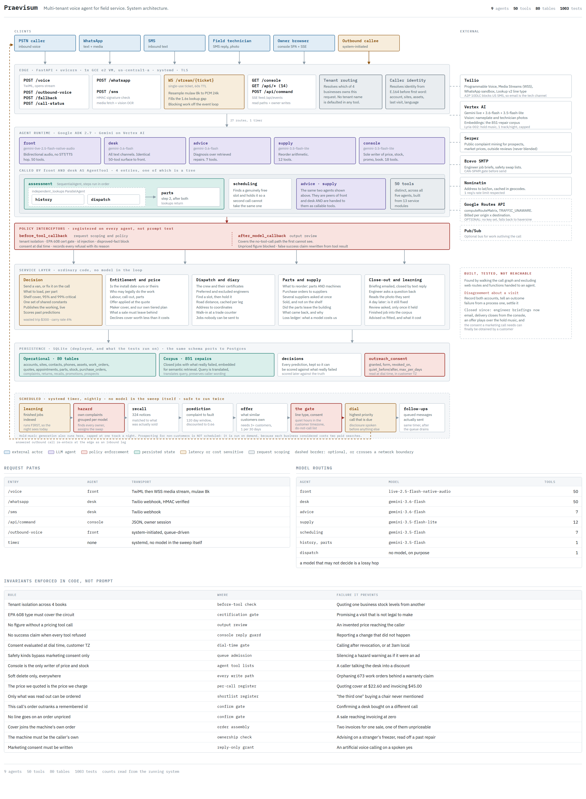

<div align="center">

# Praevisum

*prae-VEE-sum* &middot; Latin, **foreseen**

### One phone number. Four businesses behind it. The caller never hears about that.

[](https://twiliotestduck.duckdns.org/console)
[](docs/architecture.md)
[](#which-google-models)
[](tests/)
[](https://google.github.io/adk-docs/)

### Ring it: **+1 857 361 7165**

Ask for a projector, a chair, a laptop or a freezer. Or say one of your
machines has stopped working. It is the same number either way, and it answers
as whichever of the four businesses sells what you asked for.

**[The owner's console](https://twiliotestduck.duckdns.org/console)** &middot;
**[The architecture](https://claude.ai/code/artifact/3c54a6d2-de63-400f-9d78-60cae3e540b9)** &middot;
**[As a PDF](docs/architecture.pdf)**

</div>

---

A refrigeration dealer, an IT reseller, an office furniture supplier and an
audio-visual company share a service desk. Somebody rings about a freezer, a
laptop, a chair or a projector and is served by whichever of the four sells it,
without being transferred, put on hold, or told "that is a different
department". The same desk answers WhatsApp. The same desk remembers what it
sold them last month.

Built for the **All Things Agentic Hackathon**.

[](https://claude.ai/code/artifact/3c54a6d2-de63-400f-9d78-60cae3e540b9)

---

## Why this exists

> **Sabre printers catch fire.**
> The company knew which model it was.
> Nobody put that knowledge anywhere it could stop the next sale.

Dunder Mifflin Scranton survived the big box stores on one thing. Pam knew your
name when you rang, and Dwight knew your printer had jammed the same way twice
before. That is the whole competitive advantage of a small regional supplier,
and it lives in the heads of about four people.

Every small dealer already knows which freezer eats compressors, which chair
comes back, and which customer needs the engineer to bring the second gasket.
It sits in a technician's memory and walks out of the door when they do.

This puts it somewhere that can answer the phone.

---

## What happens when somebody rings

<details open>
<summary><b>They want to buy something</b></summary>

<br>

It reads out what is actually on the shelf, at their price, in order. If this
business does not stock it but another of the four does, the call moves across
and the caller only notices that the answer arrived.

Say "the last one" and it knows which one that was. Not the last row in the
database. The last thing it said out loud.

Before the order is placed it says what the maker's warranty covers. When the
maker's terms are not on file, it offers cover of our own instead of saying "I
do not know", and where that cover would cost more than a fifth of the
purchase, **it tells them not to buy it.**

The machine, the cover and the real carrier options go on one invoice, read
back before anything is placed.

```
Kodak Mini Portable Projector        $199.99
Essential cover, 2 years              $30.00
TOTAL                                $229.99

local van   same day    free
FedEx 2Day  Sept 2     $29.40
UPS 2nd Day Sept 2     $31.80
```

</details>

<details>
<summary><b>Something is broken</b></summary>

<br>

It finds which of **their** machines they mean, from what they said, without
ever asking for a model number or an account reference. We have those. They do
not.

It works out whether a visit is even warranted, or whether it can be talked
through on the call. If somebody has to go, it finds an engineer who is
qualified and near, checks whether the blocking part is already in their van,
and offers a real slot from the diary.

When nobody can be sent it says so and escalates, rather than inventing a date.

Then the engineer gets the briefing by email: what this exact unit needed last
time, what the same model does elsewhere, what the customer photographed, and
what to put in the van. They text back what they actually fitted, and the book
learns from it.

</details>

<details>
<summary><b>Afterwards, going the other way</b></summary>

<br>

Once, after a sale or a complaint, it asks whether it may tell them about
offers. Saying yes on the phone is not enough, because an artificial voice
making a marketing call needs written consent. So it messages, and only their
reply grants it. A no stands forever.

Then it matches what their own kit suggests they need and do not have, and a
prospect hunter finds businesses worth approaching from public listings. It
refuses to ring most of them, which is the point.

</details>

---

## What it does that a phone system does not

<details>
<summary><b>It knows what our own vans have seen</b></summary>

<br>

Recommendations are ranked by what has broken in our service record, not by
review scores. Ranking by fewest faults sounds right and is useless: everything
we have never touched scores zero and floats to the top. So it is smoothed.

```sql
(faults + complaints + 1.0) / (installed + 2.0) AS trouble_rate
```

A model with one clean unit cannot outrank one proven over forty, and below the
sample threshold it says "we only have two, I honestly cannot tell you".

</details>

<details>
<summary><b>It tells people not to buy things</b></summary>

<br>

Herman Miller covers a chair for twelve years including labour. Humanscale
covers fifteen. Selling somebody three more years on top of that is selling
them nothing.

Above a fifth of the purchase price the published consumer advice is to
decline, and so does the desk. On a two hundred dollar projector that means
three years of cover is refused and two years offered instead.

</details>

<details>
<summary><b>It knows what each product costs after the sale</b></summary>

<br>

This is the Sabre printer problem, solved directly. Service visits, returns and
warranty claims are posted against the model that caused them.

```
Continental 1FEN     1 return     $1,034.25
Desmon PGM14C-C-A    1 visit        $463.10
```

Read per unit sold, never as a total, because a model we have sold two hundred
of will always top a raw loss list and be the better product. Below four units
sold it says "too few to judge" rather than ranking.

A product that sells well and costs more in service than it earned is not a
reorder. **It is a delisting**, and the restocking advice refuses to buy more.

</details>

<details>
<summary><b>It knows whether its own advice was any good</b></summary>

<br>

What the engineer was told to take and what they actually fitted are both
recorded, and scored in two directions because they are different mistakes:

| | |
|---|---|
| told them to take 4, they fitted 1 | we are filling the van with junk |
| they fitted 3, we had named 1 | **we are causing second visits** |

The second one is the expensive failure. Averaging them into one number reports
something true of neither.

</details>

---

## The part worth arguing with

<div align="center">

> ## "FALSE."
> **Dwight Schrute**, on data he cannot verify

</div>

A language model asked to carry a fact across a boundary will drop it. Not
often enough to notice in testing, and often enough to matter on a Tuesday
afternoon. Every serious fault this system has had was that:

| What it dropped | What happened |
|---|---|
| an order number | a freezer bought that afternoon confirmed against a standing desk from an hour earlier |
| a price | cover quoted at **$22.60** went onto the invoice at **$45.00** |
| a position in a list | "the third one" bought a chair that had never been read out |
| a machine | a customer who rang about their own laptop was offered a stranger's, then asked to read out a model number for something we sold them three hours before |

The instinct is to write a better prompt. It does not work, and there are
transcripts proving it, because the instructions already said all of those
things in capital letters.

What works is refusing to ask the model to remember. What was quoted, what was
offered, what they chose and which order this conversation raised are kept
where it cannot lose them, and checked in code before every single tool call.

<details>
<summary><b>The checks that run before every tool call</b></summary>

<br>

| Rule | Failure it prevents |
|---|---|
| Tenant isolation across four books | quoting one business's stock from another's shelf |
| No figure without a pricing tool call | an invented price reaching the caller |
| The price we quoted is the price we charge | quoting $22.60 and invoicing $45.00 |
| Only what was read out can be ordered | "the third one" buying a chair never mentioned |
| This call's order outranks a remembered id | confirming an order from a different call |
| No line goes on an order unpriced | a sale reaching invoicing at zero |
| Cover joins the machine's own order | two invoices for one sale |
| The machine must be the caller's own | advising on a stranger's freezer |
| EPA 608 type must cover the circuit | promising a visit that is not legal to make |
| Marketing consent must be written | an artificial voice calling on a spoken yes |
| Soft delete only, everywhere | orphaning 673 work orders behind a warranty claim |

</details>

---

## Where the data comes from

Nothing here is invented for a demo except the customers themselves.

| | |
|---|---|
| **88,544** equipment models | US Energy Star certification data, with efficiency and refrigerant |
| **923** products on the shelf | real retail listings, at real prices |
| **851** closed repairs | searchable by meaning, so "not holding overnight" finds "iced evaporator" |
| **757** machines | on 165 customer accounts across the four businesses |
| **19** engineers | with certifications, van stock and home bases |
| Federal recall data | so a recalled machine is never recommended without saying so |

---

<a name="which-google-models"></a>

## Which Google models

<details>
<summary><b>Nine models across four families</b></summary>

<br>

| Model | What it does here |
|---|---|
| **Gemini Live 2.5 Flash**, native audio | the phone line itself, bidirectional, no speech-to-text hop |
| **Gemini 3.6 Flash** | the reasoning that weighs our repair record against a spec sheet |
| **Gemini 3.5 Flash** | lookups, scheduling, fault history |
| **Gemini 3.5 Flash Lite** | ordering and reorder arithmetic |
| **Gemini 2.5 Flash TTS** | records the offer that plays over the hold music |
| **Lyria 002** | generates the hold music, six tracks, rotating |
| **Gemini Embedding 001** | matches "a fridge for drinks" to what we actually stock |
| **Text Embedding 005** | indexes the repair corpus |
| **Gemma 3** | parses the engineer's text-back, locally, never sees a customer |

Hold music generated rather than licensed is the entire reason a small dealer
can have any.

**SDKs:** Google Agent Development Kit 2.7 and the Google Gen AI SDK, both
against Vertex AI.

</details>

---

## Running it

```bash
pip install -r requirements.txt
python scripts/load_all.py          # build the book
uvicorn src.main:app --reload       # the desk and the console
```

The console is at `/console`. Point a phone number's voice webhook at `/voice`
and its messaging webhook at `/whatsapp`. Configuration lives in `.env`.

---

## Honest caveats

<details>
<summary><b>Five things that are wrong with it</b></summary>

<br>

**Advice takes about half a minute.** Weighing our own repair record against
the catalogue is several model calls, and the caller hears music while it runs.
The music is honest and it is not an answer.

**Machines can be registered twice.** A customer describing something they
already own can produce a second record of it, and an engineer certified on
"laptop" is not certified on "notebook". The family matching is too literal.

**The book is one file.** SQLite on one machine. Right for four dealers, wrong
for forty, and the schema ports without changes.

**Warranty terms are held for far fewer makes than we sell.** Offering our own
cover when the maker's terms are unknown is honest, and it papers over a gap
rather than closing it.

**Rate limits degrade a call mid-sentence.** When the model provider throttles
us the desk retries once and plays music rather than silence. That is all it
can do, and it is visible in the transcripts.

</details>

---

### Notices

All manufacturer names, model numbers and diagnostic codes are used
nominatively to identify compatible equipment. No affiliation with,
sponsorship by, or endorsement from any manufacturer is claimed or implied.
**All customers, technicians, sites, work orders and repair records in this
repository are fictional** and exist to demonstrate the system.

<div align="center">
<br>

*Bears. Beets. Commercial refrigeration.*

</div>
