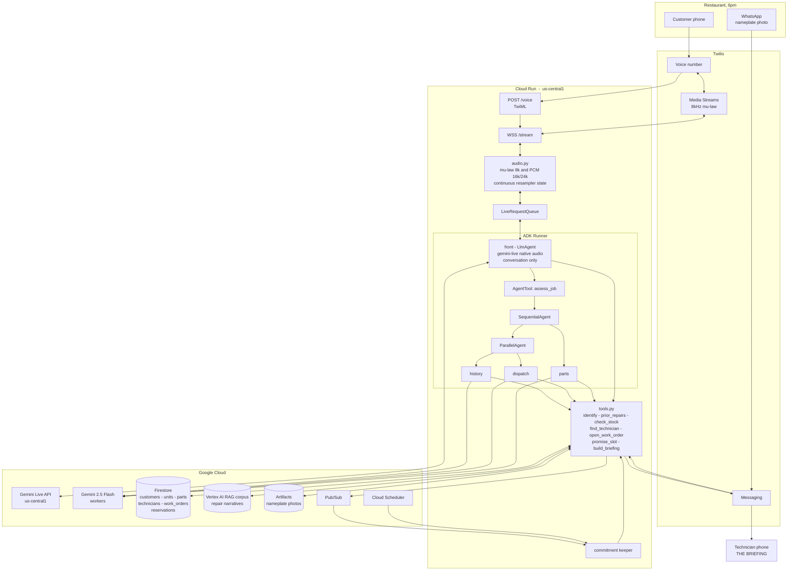
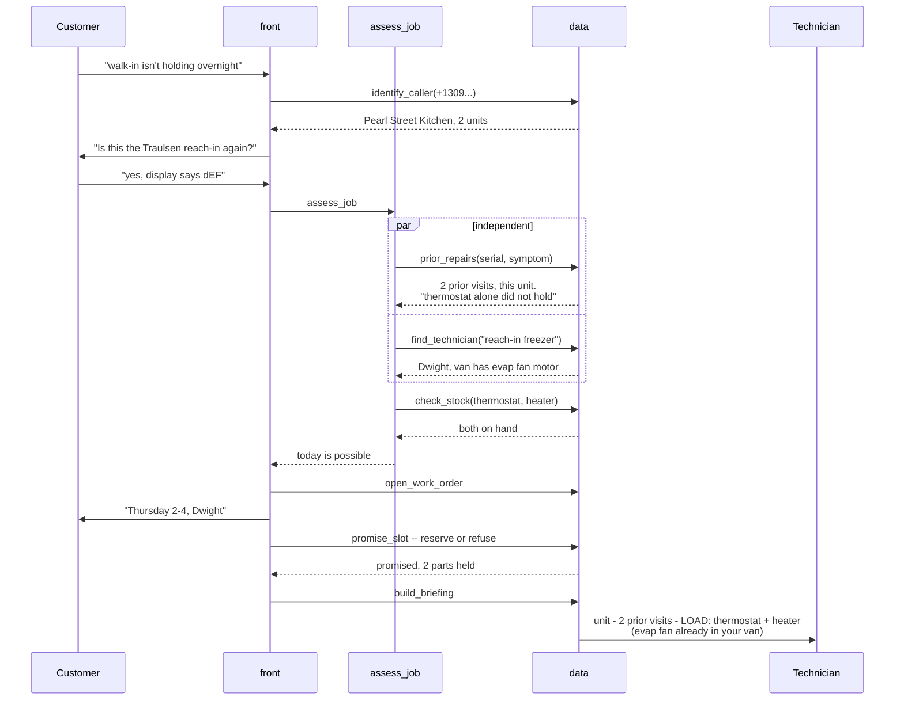

# Praevisum - architecture

Written to be argued with. The last section lists what I think is wrong with it.

---

## System

## The one path that matters

## Layers

| Layer | Owns | Rule |
|---|---|---|
| **Conversation** (`front`) | Turn-taking, tone, disclosure, when to reach for a tool | Knows nothing about refrigeration. Never asserts a fact a tool didn't return. |
| **Assessment** (`assess_job`) | History, availability, stock | Read-only. Produces no side effects, makes no promise. |
| **Decision** (`tools.py`) | Work orders, reservations, promises, briefings | Deterministic. The model chooses *which* tool; code decides *whether* it can happen. |
| **Durability** (Firestore / RAG / Artifacts) | State that outlives the call | Behind `store.py`. Nothing above this layer knows the backend. |
| **Continuity** (commitment keeper) | The promise after the call ends | Runs on a schedule, not on a request. |

**Non-negotiable:** a promise is refused, never softened. `promise_slot` releases every part it already took and names the blocking SKU rather than committing a window it cannot keep.

---

## Known weaknesses - this is the part to fix

### 1. `assess_job` blocks the turn. This is the big one.
The README claims specialists run "while the customer is still talking." **Architecturally that is not true yet.** `AgentTool` is a normal tool call: the front agent's turn does not complete until it returns. `ParallelAgent` cuts wall-clock time (history and dispatch overlap) but the conversation still stalls for the duration.

Two honest options:
- **(a) Own it.** Keep the blocking call, have `front` narrate through it ("let me pull that unit's history - one moment"). Simple, truthful, and a two-second gap on a service call is normal human behaviour.
- **(b) Fix it properly.** Fire the assessment as an `asyncio` task on call start, write results into session state under `assessment_ready`, and let `front` read state instead of calling a tool. Genuinely non-blocking, and it makes the architectural claim real.

(b) is the better project and maybe half a day. **I'd do (b).** But it should be a decision, not drift.

### 2. `Store.reserve()` is a read-then-write race
`available()` then `reservations[sku] = ...` with nothing between them. Two concurrent calls can both be promised the last defrost timer. In-memory it's a latent bug; on Firestore it needs a **transaction**. Since "the part gets pulled out from under the promise" is literally the demo's climax, this has to be correct rather than approximately correct.

### 3. Cloud Run will drop live calls
A WebSocket plus in-process session state on a service that scales to zero and evicts instances means a restart mid-call kills it. Needs `--min-instances=1`, `--session-affinity`, and a generous request timeout. Sessions are `InMemorySessionService` today - moving to `DatabaseSessionService` or `VertexAiSessionService` is what makes a mid-call restart survivable.

### 4. `/stream` is unauthenticated
Anyone who finds the URL can open a socket and burn Vertex tokens. Needs Twilio signature validation on `/voice` and a short-lived signed token in the stream URL.

### 5. History reads the Store, not the RAG corpus
`prior_repairs` does keyword matching over seeded records. The design says Vertex AI RAG with semantic search. Fine for now - but "customer describes a fault in words that don't match the record" is exactly where keyword matching fails and semantic retrieval earns its place.

### 6. Barge-in depends on an unverified field
`twilio_bridge` checks `event.interrupted` defensively via `getattr`. If ADK signals interruption differently, the agent talks over the customer and the demo dies on camera. **Verify against a real call before anything else.**

### 7. Narrowband audio
Telephony is 8kHz. Upsampling to 16kHz adds no information. A stressed caller in a loud kitchen is the worst case for recognition, and the demo audio should be recorded somewhere quiet.

---

## Deferred on purpose

Equipment specialist per brand (manuals into 2M context) - photo to model resolution - commitment keeper - eval/ablation harness - Vertex AI Agent Engine deployment.

Each is a row in the README honesty table and none is claimed as working.
