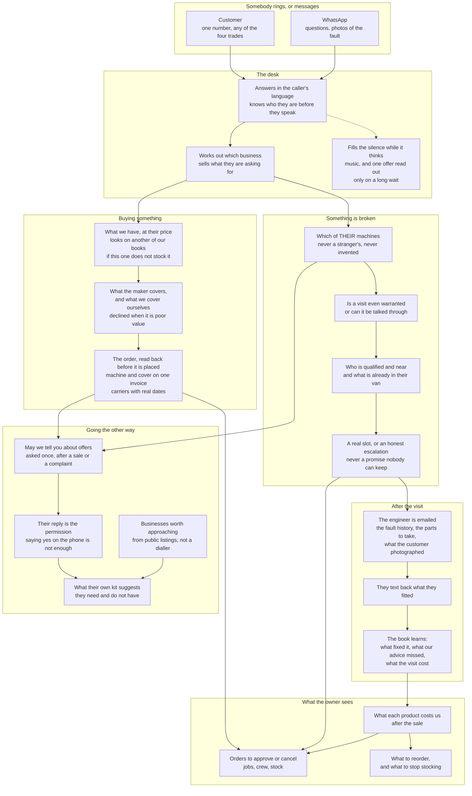
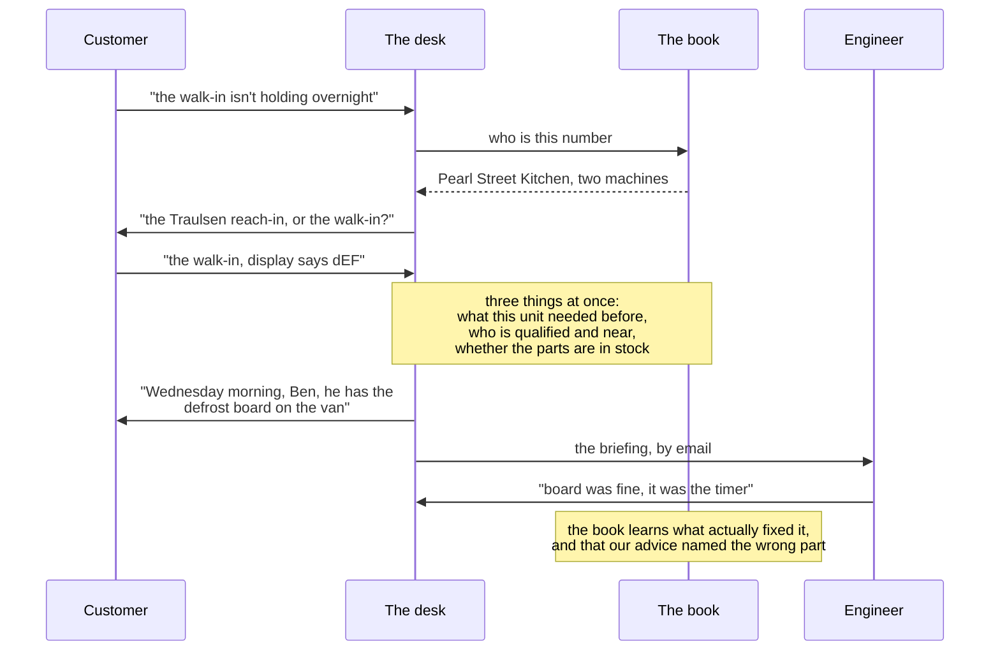

# Praevisum - architecture

One phone number. Four businesses behind it. The caller never hears about that.

Written to be argued with. The last section lists what is wrong with it.

---

## What it is

A refrigeration dealer, an IT reseller, an office furniture supplier and an
audio-visual company share a service desk. A customer rings one number and is
served by whichever of the four sells what they are asking about, without ever
being transferred, put on hold, or told "that is a different department".

The same desk answers WhatsApp, and the same desk knows what it sold you last
month, what it has fixed for other people, and what that model costs the
business after the sale.

---

## The whole thing, end to end

---

## What happens on one call

---

## The ideas worth arguing with

**The caller is never asked for an identifier.** Not an account number, not a
model number, not an order reference. We have those; they do not. Every place
the desk asked for one was a bug, and each is now closed in code rather than
by asking the model to remember.

**Nothing is promised that the book cannot keep.** A delivery date comes from
the carrier table, a repair slot from the diary, a price from the price list.
Where there is no answer, the desk says so and escalates, which is why a
customer sometimes hears "I cannot staff that today" instead of a date that
would have been fiction.

**We sell cover, and we talk people out of it.** Where a maker already covers
a chair for twelve years, or the plan would cost more than a fifth of what
they are paying, the desk says not to buy it. That refusal is worth more than
the sale.

**Marketing permission has to be written.** Agreeing on the phone is not
enough, because an artificial voice making a marketing call needs prior
express written consent. So the desk texts, and only a reply grants it.

**Loss decides what we stock.** Service visits, returns and claims are posted
against the model that caused them. A product that sells well and costs more
after the sale than it earned is not a reorder, it is a delisting.

**Guards, not instructions.** A model asked to be careful will be careful most
of the time. The identifiers, the prices, the shortlist and the company
boundary are all enforced in code that runs before every tool call, because
"most of the time" is the wrong number when it decides what somebody is
charged.

---

## Known weaknesses - the part to fix

**1. Advice takes half a minute.** Weighing our own repair record against the
catalogue is several model calls, and the caller hears music while it runs.
The music is honest and it is not an answer.

**2. Machines get registered twice.** A customer describing a laptop they
already own can produce a second record of it, and a technician certified on
"laptop" is not certified on "notebook". The matching is by family name and it
is too literal.

**3. The book is one file.** SQLite on one machine, backed up by copying it.
Fine for four dealers, wrong for forty.

**4. The desk speaks ten languages and holds terms for far fewer makes.** When
the maker's warranty is unknown it offers our own cover, which is honest, but
it is a gap being papered over rather than closed.

**5. Nothing measures whether the advice is any good, yet.** The recommended
parts and the fitted parts are both recorded now, and the comparison needs
more closed visits behind it before the number means anything.

**6. Quota is a single point of failure.** When the model provider rate-limits
us, the desk degrades mid-sentence. It retries, and it plays music rather than
silence, and that is all it can do.
